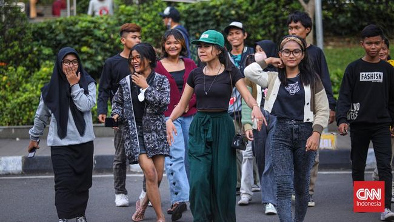
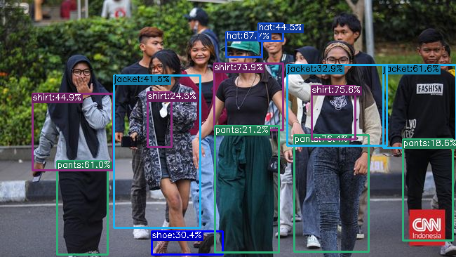

# Fashion Object Detection using YOLOX

[YOLOX](https://github.com/Megvii-BaseDetection/YOLOX) implementation in Image Fashion applying custom weights in training Dataset [Colorful Fashion Dataset For Object Detection](https://www.kaggle.com/datasets/nguyngiabol/colorful-fashion-dataset-for-object-detection) for object detection. Using YOLOX-s as base model for training 10 fashion classes. This application generates an API that may be used to identify fashion in images. Heroku, FastAPI, and PyTorch (YOLOX) are the technologies used.

Example result:

**input**:

**output**:

Visit Here for sample:

> https://simple-fashion-detection.herokuapp.com/docs

